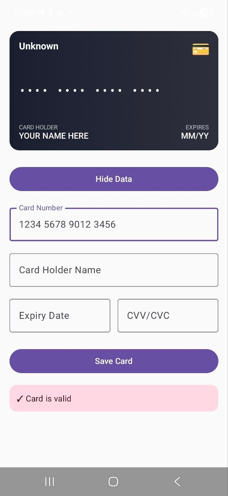

# CardCard

**Форма для ввода данных банковской карты**

Kotlin Multiplatform приложение на базе Compose Multiplatform с поддержкой Android и iOS.

## Описание задания

Задача — разработать удобную и современную форму для ввода данных банковской карты (номер карты, срок действия, CVV/CVC, имя держателя и т.д.).

Приложение реализовано с помощью **Kotlin Multiplatform + Compose Multiplatform**, что позволяет использовать один и тот же код UI и логики на Android и iOS.

Основные возможности:
- Валидация номера карты в реальном времени (определение платёжной системы)
- Автоматическое форматирование номера карты (пробелы каждые 4 цифры)
- Ввод срока действия (MM/YY)
- Поле CVV/CVC с маскировкой
- Поле имени держателя карты
- Красивый и responsive дизайн

## Скриншоты экранов

## Видео демонстрации

https://disk.360.yandex.ru/i/bmbrnGdJgV-IJw

## Скачать APK

Прямая ссылка на debug-APK (размещён в репозитории):  
[composeApp.apk](composeApp.apk)

## Инструкция по запуску

### Требования
- Android Studio (рекомендуется последняя версия с поддержкой KMP)
- Для iOS: macOS + Xcode
- JDK 36 или выше

### Запуск Android приложения

## Открой проект в Android Studio и запусти конфигурацию composeApp

### ИИ инструменты:

- DeepSeek
- Grok
- Cursor
- Qwen